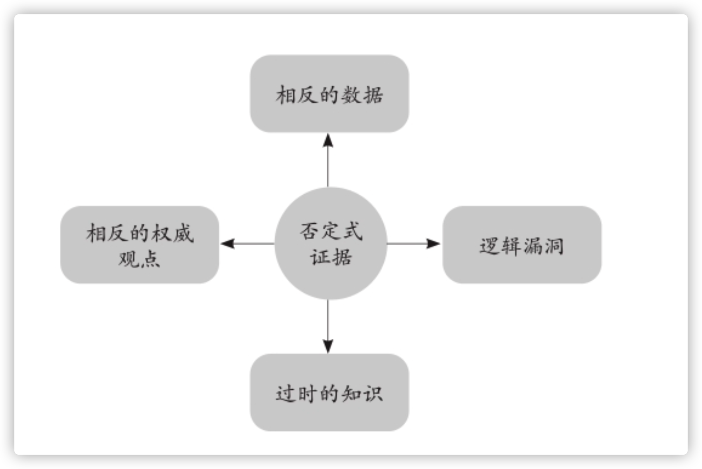
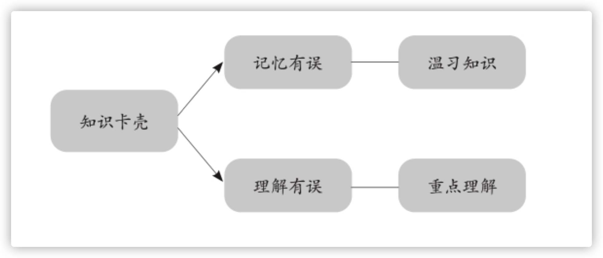
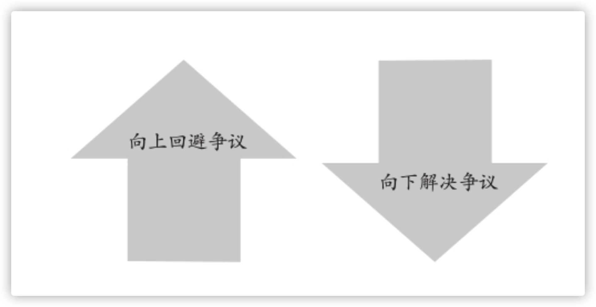
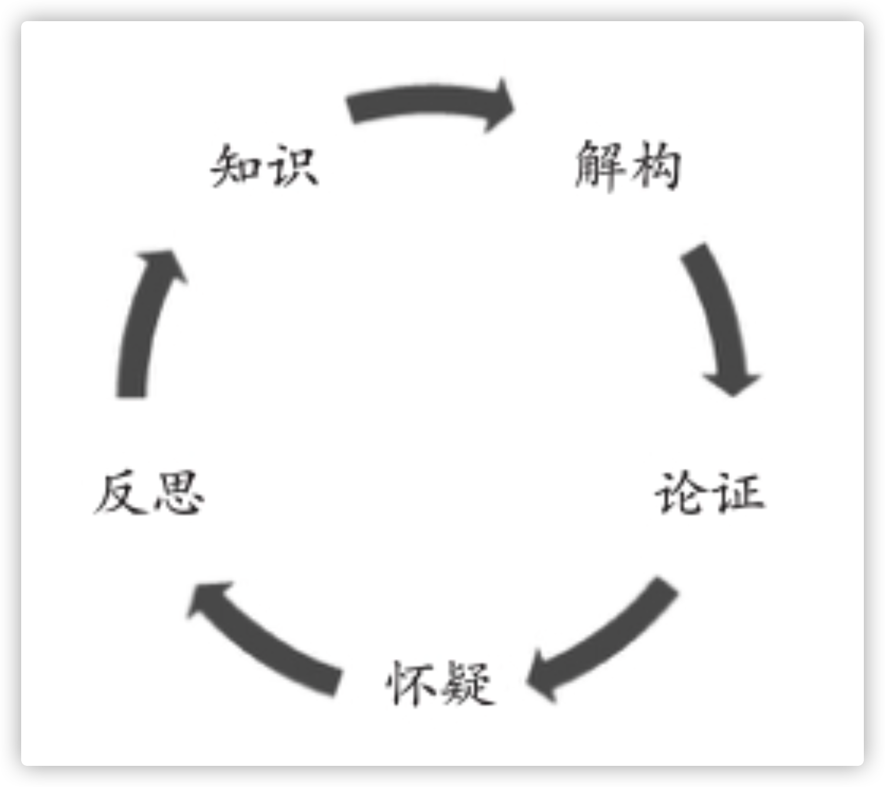
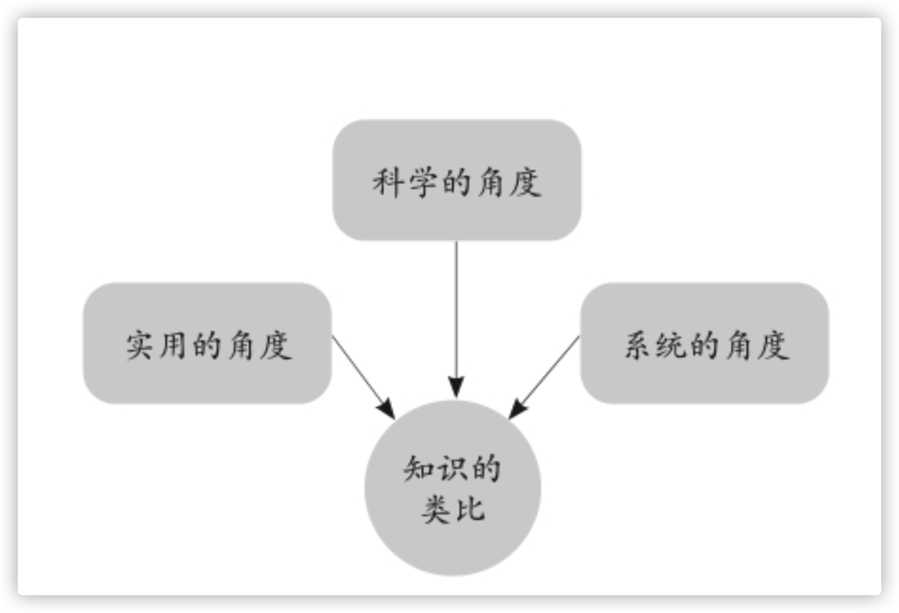

## 什么是寻找反证？
寻找反证的过程就是有目的地反思。反思是对学习的质量进行解构，保证自己学到的是正确的知识。

## 寻找反证的作用有哪些？
* 第一，反思能够帮助我们发现知识本身存在的误区。
* 第二，反思能促进我们在已有知识的基础上产生新的知识。

所以真正的反思必须结合行动，要在学以致用的环节实现对知识的检查，督促我们去将经得起事实检验的知识运用起来，转化为我们的思维成果，内化为我们的实际能力。

## 重视否定式证据

重视知识的“否定式证据”，即要求我们为学习搜集一切的“必备要素”，不能仅有正面信息，还要有充分的负面信息。如此才能避免学习时对知识的倾向性。我们在学习时总是会被特定的倾向性所困扰，要做出客观的结论，就必须勇敢地打破这种倾向性，不能盲目地相信一种知识，不能迷信单一的知识来源。

## 当知识卡壳:回到理解不清的地方，找出薄弱环节

如果是记忆有误，有些关键内容突然记不起来了，便集中注意力重新温习一遍相关的内容，加强对这段知识的记忆;如果是理解有误，则要回到这段理解不清的地方，找出失误之处，重点理解，弥补薄弱的环节。

## 争议是深度学习的切入点

沉下来化解争议，从有争议的知识点中获得宝贵的智慧。

“最好的学习是我们能从一个问题里找到新的问题，你不喜欢、不赞赏、不认可的东西，那才是知识这顶皇冠上的宝石。如果你憎恶争议，或者没有挑刺的习惯，就如同你扔掉了这颗宝石，只戴一顶漂亮但毫无价值的帽子。”

## 没有“最可靠”的结论

这是一个正确的逻辑闭环，告诉我们别相信任何一种学术结论，哪怕是最权威的声音，也不能奉为至宝或捧上神坛。在上面的循环结构中，知识是动态变化的，一方面我们不断地解构它，理解它，另一方面也通过论证、怀疑和反思更新它的内容，使知识保持常新，尽可能地真实而客观。

## 和已有的知识建立多角度的类比关系

在对所学的知识寻找反证的过程中，与自己已有的知识建立多角度的类比关系有助于我们发现自身的不足，还有新知识的问题，同时也能将新知识融入自身的知识体系中，把它们衔接成一体。这也是一个保留科学、实用和系统化知识的过程。