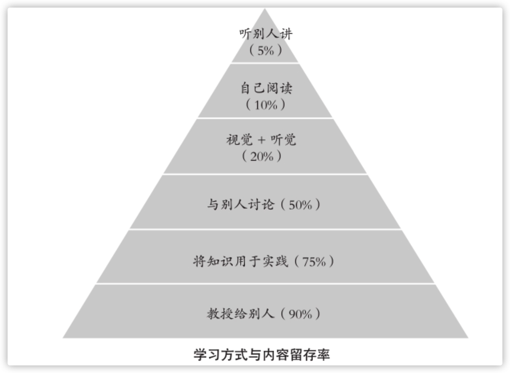

## 只有以讨论、输出为主的学习方法，才能用较少的代价 获得较高的内容留存率

## 如何教？
最通俗的语言 去阐述它，用最普通的词语和最短的句子，同时做到精准无误。
* 第一，语言简洁易懂。
* 第二，精准到位，没有歧义。
* 第三，讲出一定的深度。
* 四，加上自己的理解。

## 强化认知 => [[费曼学习法.输出是最强大的学习力.用“输出”倒逼“输入”]]
阐述知识的同时，我们也在强化自己对于知识尤其是重点内容的 认知。

让听者在他的能力和已知知识的范围内可以迅速地理解，是我们 输出知识时的一个基础原则。否则你就是在鸡同鸭讲，对方听不懂， 你自己也很累。`你懂得什么并不重要，能让任何人都能听明白，才代 表你真正地学透了这个知识。`
