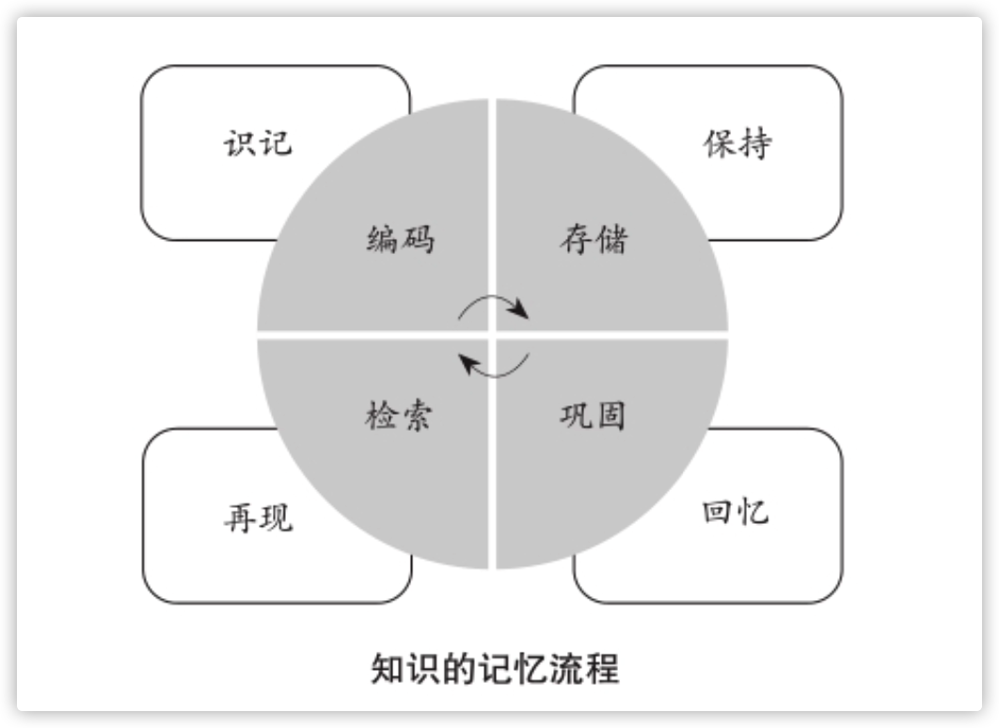

## 输出有什么作用？
在传授的场景输出给别人以后，对于重要的知识点，你的印象将 更加深刻;对不容易理解的地方，你的分析也将更加深入。

## 输出的`记忆学原理`

* 第一，识记——编码。
> 保证自己拥有一个完整的知识系统，能对信息进行系统性的程序化处 理，接触到的知识进入大脑前都会被自动化地归类。
* 第二，保持——存储。
> 学习一个知识点的时候，要详细的了解相关内容，并且反复阅读和做笔记时，大 脑的记忆机制就会推动产生神经回路网络。联系越多，记忆就越牢固， 知识在大脑内就会更长时间地保持和存储下去。
* 第三，再现——检索。
> 
当我们需要输出知识时，对记忆而言一个重要的变化将会产生。 如同平地起惊雷，`大脑将开启管理知识的新模式——从单向的输入转 变为同步的输出和输入。`
* 第四，回忆——巩固。
我们学到的知识如果不加以复习，结果注定是遗忘。输出就是一次高质量的复习，起到`巩固记忆`和`提炼核心知识`的目的。通过有`针对性的、反复地输出`，长时记忆甚至可以转化为永久记忆，做到终生不忘。我们在生活和工作中不假思索便能运用的知识，大部分都源于长 时记忆或者永久记忆。

从记忆学的角度看，在输出相关的知识时，等于我们的大脑 不断地重复记忆的四个环节:识记、保持、再现和回忆，一遍又一遍 地开垦这个知识，倒逼输入，也加快记忆和理解。

## 场景和思维模拟
* 模拟解说者的场景:假设你正向人们介绍一门对他们很重要而 且迫切需要了解的知识，务必取得他们的认同。例如演讲。
* 模拟受询者的场景:假设你正接受质询和考核，必须回答问题 和阐述你对于某个话题/知识的看法。例如面试。
* 模拟传授者的思维:模拟老师或其他传授者的思维去阐述你对 知识的认知，不要把自己当成学习者。例如讲课。
* 模拟质疑者的思维:模拟怀疑/否定/质疑者的思考方式，想想 他们会提出怎样的疑问，然后逐一解答。例如辩论。